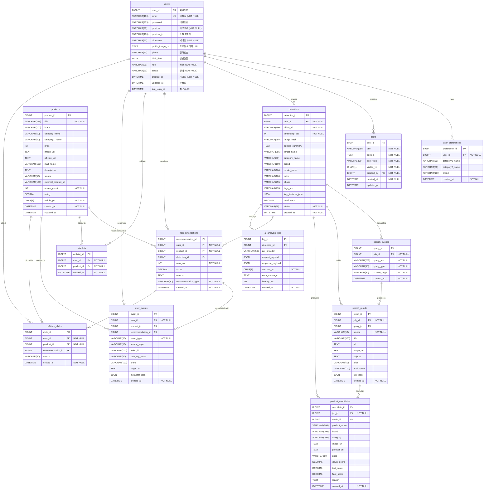

# SyncShopper Entity-Relationship Diagram

첨부해주신 이미지는 **ERDCloud** 나 **AQueryTool** 같은 전문적인 데이터베이스 모델링 툴을 사용한 화면입니다. 아쉽게도 마크다운 환경에서는 저렇게 테이블별로 색상을 다르게 하거나 다단 형태의 완벽히 동일한 UI를 렌더링하기는 어렵습니다.

하지만 **가장 비슷한 시각적 효과**를 얻으실 수 있도록 두 가지 방법을 준비했습니다!

---

## 방법 1. ERDCloud / AQueryTool 직접 사용 (이미지와 100% 동일한 방법)
현재 작성되어 있는 `database/schema.sql` 파일의 내용을 복사하신 뒤, [ERDCloud](https://www.erdcloud.com/) 에 접속하셔서 **[가져오기(Import) -> SQL]** 기능을 사용해 붙여넣기 하시면 이미지와 완벽히 동일한 ERD를 즉시 얻으실 수 있습니다.

---

## 방법 2. dbdiagram.io 사용 (강력 추천)
아래의 DBML 코드를 복사해서 [dbdiagram.io](https://dbdiagram.io/d) 에 붙여넣으시면, 첨부하신 이미지처럼 테이블 간의 관계가 깔끔하게 정리된 **컬러풀하고 인터랙티브한 ERD**가 즉시 생성됩니다!

```dbml
// ==========================================
// SyncShopper DBML Schema
// 복사해서 https://dbdiagram.io/d 에 붙여넣으세요!
// ==========================================

Table users {
  user_id BIGINT [pk, increment, note: "회원번호"]
  email VARCHAR(100) [unique, not null, note: "이메일"]
  password VARCHAR(255) [note: "비밀번호"]
  provider VARCHAR(20) [not null, default: 'LOCAL', note: "가입경로"]
  provider_id VARCHAR(100) [note: "소셜 식별자"]
  nickname VARCHAR(50) [not null, note: "닉네임"]
  profile_image_url TEXT [note: "프로필 이미지"]
  phone VARCHAR(20) [note: "전화번호"]
  birth_date DATE [note: "생년월일"]
  role VARCHAR(20) [not null, default: 'USER', note: "권한"]
  status VARCHAR(20) [not null, default: 'ACTIVE', note: "상태"]
  created_at DATETIME [not null, default: `CURRENT_TIMESTAMP`]
  updated_at DATETIME
  last_login_at DATETIME
}

Table user_preferences {
  preference_id BIGINT [pk, increment]
  user_id BIGINT [not null, ref: > users.user_id]
  category1_name VARCHAR(50)
  category2_name VARCHAR(50)
  brand VARCHAR(100)
  created_at DATETIME [not null, default: `CURRENT_TIMESTAMP`]
}

Table products {
  product_id BIGINT [pk, increment]
  title VARCHAR(255) [not null]
  brand VARCHAR(100)
  category_name VARCHAR(50)
  category1_name VARCHAR(50)
  category2_name VARCHAR(50)
  category3_name VARCHAR(50)
  category4_name VARCHAR(50)
  price INT
  image_url TEXT
  affiliate_url TEXT
  mall_name VARCHAR(100)
  description TEXT
  source VARCHAR(50)
  external_product_id VARCHAR(100)
  review_count INT [not null, default: 0]
  rating DECIMAL(2,1)
  visible_yn CHAR(1) [not null, default: 'Y']
  created_at DATETIME [not null, default: `CURRENT_TIMESTAMP`]
  updated_at DATETIME
}

Table posts {
  post_id BIGINT [pk, increment]
  title VARCHAR(255) [not null]
  content TEXT [not null]
  post_type VARCHAR(30) [not null]
  visible_yn CHAR(1) [not null, default: 'Y']
  created_by BIGINT [not null, ref: > users.user_id]
  created_at DATETIME [not null, default: `CURRENT_TIMESTAMP`]
  updated_at DATETIME
}

Table detections {
  detection_id BIGINT [pk, increment]
  user_id BIGINT [not null, ref: > users.user_id]
  video_id VARCHAR(100) [not null]
  timestamp_sec INT [not null]
  image_hash VARCHAR(255)
  subtitle_summary TEXT
  target_name VARCHAR(255)
  category_name VARCHAR(50)
  brand VARCHAR(100)
  model_name VARCHAR(100)
  color VARCHAR(100)
  shape VARCHAR(255)
  logo_text VARCHAR(255)
  key_features_json JSON
  confidence DECIMAL(5,4)
  status VARCHAR(30) [not null, default: 'PENDING']
  created_at DATETIME [not null, default: `CURRENT_TIMESTAMP`]
}

Table search_queries {
  query_id BIGINT [pk, increment]
  job_id BIGINT [not null, ref: > detections.detection_id]
  query_text VARCHAR(255) [not null]
  query_type VARCHAR(30) [not null]
  source_target VARCHAR(50) [not null]
  created_at DATETIME [not null, default: `CURRENT_TIMESTAMP`]
}

Table search_results {
  result_id BIGINT [pk, increment]
  job_id BIGINT [not null, ref: > detections.detection_id]
  query_id BIGINT [ref: > search_queries.query_id]
  source VARCHAR(50) [not null]
  title VARCHAR(500)
  url TEXT
  image_url TEXT
  snippet TEXT
  price VARCHAR(50)
  mall_name VARCHAR(100)
  raw_json JSON
  created_at DATETIME [not null, default: `CURRENT_TIMESTAMP`]
}

Table product_candidates {
  candidate_id BIGINT [pk, increment]
  job_id BIGINT [not null, ref: > detections.detection_id]
  result_id BIGINT [ref: > search_results.result_id]
  product_name VARCHAR(500)
  brand VARCHAR(100)
  category VARCHAR(100)
  image_url TEXT
  product_url TEXT
  price VARCHAR(50)
  visual_score DECIMAL(6,2)
  text_score DECIMAL(6,2)
  final_score DECIMAL(6,2)
  reason TEXT
  created_at DATETIME [not null, default: `CURRENT_TIMESTAMP`]
}

Table recommendations {
  recommendation_id BIGINT [pk, increment]
  user_id BIGINT [not null, ref: > users.user_id]
  product_id BIGINT [not null, ref: > products.product_id]
  detection_id BIGINT [ref: > detections.detection_id]
  rank_no INT [not null]
  score DECIMAL(8,4)
  reason TEXT
  recommendation_type VARCHAR(30) [not null, default: 'GENERAL']
  created_at DATETIME [not null, default: `CURRENT_TIMESTAMP`]
}

Table wishlists {
  wishlist_id BIGINT [pk, increment]
  user_id BIGINT [not null, ref: > users.user_id]
  product_id BIGINT [not null, ref: > products.product_id]
  created_at DATETIME [not null, default: `CURRENT_TIMESTAMP`]
}

Table user_events {
  event_id BIGINT [pk, increment]
  user_id BIGINT [not null, ref: > users.user_id]
  product_id BIGINT [ref: > products.product_id]
  recommendation_id BIGINT [ref: > recommendations.recommendation_id]
  event_type VARCHAR(30) [not null]
  source_page VARCHAR(50)
  video_id VARCHAR(100)
  category_name VARCHAR(50)
  brand VARCHAR(100)
  target_url TEXT
  metadata_json JSON
  created_at DATETIME [not null, default: `CURRENT_TIMESTAMP`]
}

Table ai_analysis_logs {
  log_id BIGINT [pk, increment]
  detection_id BIGINT [ref: > detections.detection_id]
  api_provider VARCHAR(50)
  request_payload JSON
  response_payload JSON
  success_yn CHAR(1) [not null, default: 'N']
  error_message TEXT
  latency_ms INT
  created_at DATETIME [not null, default: `CURRENT_TIMESTAMP`]
}

Table affiliate_clicks {
  click_id BIGINT [pk, increment]
  user_id BIGINT [not null, ref: > users.user_id]
  product_id BIGINT [not null, ref: > products.product_id]
  recommendation_id BIGINT [ref: > recommendations.recommendation_id]
  source VARCHAR(50)
  clicked_at DATETIME [not null, default: `CURRENT_TIMESTAMP`]
}
```

---

## 방법 3. 상세화된 Mermaid ERD
마크다운 환경에서 곧바로 볼 수 있도록, 이전보다 더 구체적인 정보(데이터 타입, NOT NULL 제약조건 등)를 추가한 버전입니다.


